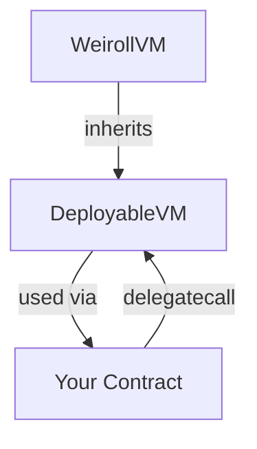

## Contract Overview

The `DeployableVM` contract is a minimal wrapper around the Enso Finance Weiroll VM that enforces delegatecall-only execution. This design ensures the VM can be safely deployed as a singleton and used by any contract through delegatecall.

## Source Code

The complete implementation is remarkably concise:

```solidity
// SPDX-License-Identifier: LGPL-3.0-or-later
pragma solidity ^0.8.27;

import {VM as WeirollVM} from "lib/enso-weiroll/contracts/VM.sol";

/**
 * @title DeployableVM for arbitrary contracts wanting to use Weiroll's VM.
 * @author CoW Protocol Developers
 * @dev This contract makes use of Enso Finance's audited Weiroll VM contract available
 *      at: https://github.com/EnsoFinance/enso-weiroll. The original Weiroll is
 *      available at: https://github.com/weiroll/weiroll.
 */
contract DeployableVM is WeirollVM {
    error CallableOnlyViaDelegateCall();

    address private immutable WEIROLL_SINGLETON;

    constructor() {
        WEIROLL_SINGLETON = address(this);
    }

    function execute(bytes32[] calldata commands, bytes[] memory state) 
        public 
        payable 
        returns (bytes[] memory) 
    {
        // With the event of EIP-6780, we no longer have to guard against `SELFDESTRUCT`,
        // but the following check is added out of an abundance of caution in the event
        // the contract is deployed on a chain that does not support EIP-6780.
        require(address(this) != WEIROLL_SINGLETON, CallableOnlyViaDelegateCall());

        return _execute(commands, state);
    }
}
```

## Implementation Details

### Inheritance Structure



The `DeployableVM` inherits from the base `WeirollVM` contract provided by Enso Finance, which contains the core execution logic.

### Key Components

#### 1. Immutable Singleton Address

```solidity
address private immutable WEIROLL_SINGLETON;

constructor() {
    WEIROLL_SINGLETON = address(this);
}
```

The constructor captures the deployment address as an immutable value. This creates a permanent reference to the contract's original address that cannot be modified.

<Info>
**Why immutable?** Using `immutable` instead of a constant or storage variable:
- Saves gas by embedding the value in bytecode
- Prevents any possibility of modification after deployment
- The value is set during construction and frozen permanently
</Info>

#### 2. Delegatecall Guard

```solidity
require(address(this) != WEIROLL_SINGLETON, CallableOnlyViaDelegateCall());
```

This check enforces delegatecall-only execution:

**When called directly:**
- `address(this)` equals `WEIROLL_SINGLETON` (the deployed address)
- Check fails → transaction reverts with `CallableOnlyViaDelegateCall`

**When called via delegatecall:**
- `address(this)` equals the caller's address (not the VM's address)
- Check passes → execution proceeds

<Warning>
Direct calls to the VM are always rejected. You must use delegatecall to execute commands.
</Warning>

#### 3. Execute Function

```solidity
function execute(
    bytes32[] calldata commands, 
    bytes[] memory state
) public payable returns (bytes[] memory)
```

The execute function is the single entry point to the VM:

- **Parameters:**
  - `commands`: Array of encoded commands to execute
  - `state`: Initial state array with input parameters
- **Returns:** Modified state array containing results
- **Payable:** Can receive ETH for commands that require value transfers

## The Underlying Weiroll VM

The `DeployableVM` delegates actual execution to the `_execute` method inherited from `WeirollVM`. While the source code is in the Enso Finance repository, here's what the VM does:

### Command Decoding

Each `bytes32` command encodes:

```plaintext
┌─────────────────┬──────────────┬───────────┬─────────────────┐
│  Target (20B)   │ Selector(4B) │ Flags(1B) │ Inputs/Outputs  │
└─────────────────┴──────────────┴───────────┴─────────────────┘
```

- **Target**: Contract address to call
- **Selector**: Function selector (first 4 bytes of function signature)
- **Flags**: Control bits for call type and return handling
- **Inputs/Outputs**: Indices into the state array

### State Management

The state array serves multiple purposes:

1. **Initialization**: Caller provides initial values
2. **Execution**: VM reads inputs from specified indices
3. **Storage**: VM writes return values to specified indices
4. **Return**: Final state array is returned to caller

### Call Execution

For each command, the VM:

<Steps>
  <Step title="Extract target address and function selector">
    Decode the target contract and function to call
  </Step>
  
  <Step title="Load input parameters from state">
    Use encoded indices to load values from the state array
  </Step>
  
  <Step title="Execute the call">
    Perform call/delegatecall/staticcall based on flags
  </Step>
  
  <Step title="Store return data">
    Write return values to state array at specified indices
  </Step>
  
  <Step title="Continue to next command">
    Process remaining commands in sequence
  </Step>
</Steps>

## Usage Example

Here's how a contract would integrate and use the DeployableVM:

```solidity
contract MyContract {
    DeployableVM public immutable weirollVM;
    
    constructor(address _weirollVM) {
        weirollVM = DeployableVM(_weirollVM);
    }
    
    function executeScript(
        bytes32[] calldata commands,
        bytes[] memory state
    ) external returns (bytes[] memory) {
        // Execute via delegatecall - runs in MyContract's context
        (bool success, bytes memory result) = address(weirollVM).delegatecall(
            abi.encodeCall(DeployableVM.execute, (commands, state))
        );
        
        require(success, "Weiroll execution failed");
        return abi.decode(result, (bytes[]));
    }
}
```

<Info>
When using delegatecall, the VM executes in your contract's context:
- Uses your contract's storage
- Has your contract's `msg.sender` and `msg.value`
- Can access your contract's state variables
- All calls are made with your contract's permissions
</Info>

## Compilation and Optimization

The DeployableVM is compiled with aggressive optimization settings:

```toml
[profile.default]
optimizer = true
optimizer_runs = 1_000_000
```

This produces:
- Highly optimized bytecode
- Minimal gas consumption
- Suitable for high-frequency usage patterns

<Warning>
High optimizer runs (1M) optimize for execution cost at the expense of deployment cost. This is appropriate for singleton contracts that will be called many times.
</Warning>

## Testing

The test suite verifies the delegatecall guard:

```solidity
function test_reverts_if_not_delegatecall() public {
    bytes32[] memory commands = new bytes32[](0);
    bytes[] memory state = new bytes[](0);

    vm.expectRevert(DeployableVM.CallableOnlyViaDelegateCall.selector);
    weiVm.execute(commands, state);
}

function test_callable_via_delegatecall() public {
    bytes32[] memory commands = new bytes32[](0);
    bytes[] memory state = new bytes[](0);

    (bool success,) = address(weiVm).delegatecall(
        abi.encodeCall(DeployableVM.execute, (commands, state))
    );
    assertTrue(success);
}
```

These tests confirm:
- Direct calls are rejected ✓
- Delegatecalls are accepted ✓

## Related Topics

<CardGroup cols={2}>
  <Card title="Security Model" icon="shield-check" href="/architecture/security">
    Understand the security implications and guarantees
  </Card>
  <Card title="Integration Guide" icon="plug" href="/integration/delegate-call">
    Learn how to integrate DeployableVM in your contracts
  </Card>
</CardGroup>
